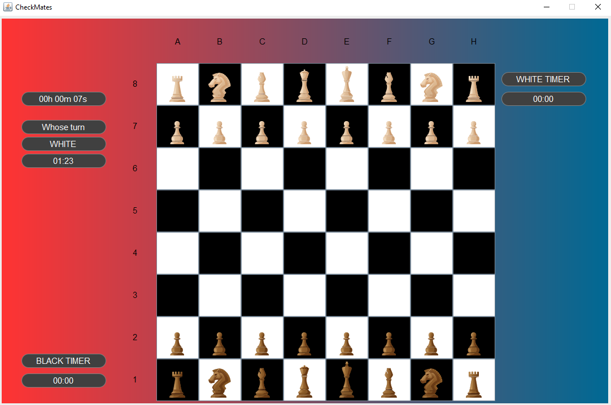

The *CheckMates* project was developed in the context of *Programming Laboratories*, a 4th year course in FEUP's MIEEC. I worked with André Aragão, André Silva and José Pedro, who I hope are doing great in their careers.

Disclaimer: the product has a some bugs, but the game is functional.~

The following image depicts a timed game, a feature of the app.

## Product Backlog

The server is currently down, as it needed to be connected to a PostgresSQL database hosted by FEUP's services, which I can't access after concluding my studies. 🤡 
        
<table class ="backlog">
<tbody>
  <tr>
    <td class = "table_td">As a...</td>
    <td class = "table_td">I want to be able to...</td>
    <td class = "table_td">So that...</td>
  </tr>
  <tr>
    <td class = "table_td">Unregistered User</td>
    <td class = "table_td">Create an account</td>
    <td class = "table_td">I can start playing and  keep track of my future games</td>
  </tr>
  <tr>
    <td class = "table_td">Registered User</td>
    <td class = "table_td">Login into my account</td>
    <td class = "table_td">I can have access to multiple features (play/watch games)</td>
  </tr>
  <tr>
    <td class = "table_td">Registered User</td>
    <td class = "table_td">Access my account management</td>
    <td class = "table_td">I can access the games history, account settings, etc.</td>
  </tr>
  <tr>
    <td class = "table_td">Registered User</td>
    <td class = "table_td">Access my account settings</td>
    <td class = "table_td">I can change my password, email, etc.</td>
  </tr>
  <tr>
    <td class = "table_td">Registered User</td>
    <td class = "table_td">Manage friends list</td>
    <td class = "table_td">I can add/remove, invite to a game, etc.</td>
  </tr>
  <tr>
    <td class = "table_td">Registered User</td>
    <td class = "table_td">Invite friends to play</td>
    <td class = "table_td">I can have fun/practice with my friends</td>
  </tr>
  <tr>
    <td class = "table_td">Registered User</td>
    <td class = "table_td">Record and consult recorded games</td>
    <td class = "table_td">I can learn from past mistakes</td>
  </tr>
  <tr>
    <td class = "table_td">Registered User</td>
    <td class = "table_td">Update app color scheme</td>
    <td class = "table_td">I can tailor the user interface to my own taste</td>
  </tr>
  <tr>
    <td class = "table_td">Registered User</td>
    <td class = "table_td">Practice with preset game states (position of certain pieces, etc.)</td>
    <td class = "table_td">I can get experience in specific moments of the game</td>
  </tr>
  <tr>
    <td class = "table_td">Registered User</td>
    <td class = "table_td">Play timed games</td>
    <td class = "table_td">I can get more competitive experience</td>
  </tr>
  <tr>
    <td class = "table_td">Administrator</td>
    <td class = "table_td">See a list of all users</td>
    <td class = "table_td">I can monitor the state of the application (server load, etc.)</td>
  </tr>
  <tr>
    <td class = "table_td">Administrator</td>
    <td class = "table_td">Ban user for inappropriate behaviour</td>
    <td class = "table_td">I can keep a good environment between the users</td>
  </tr>
  <tr>
    <td class = "table_td">Administrator</td>
    <td class = "table_td">Manage user accounts (reset password, etc.)</td>
    <td class = "table_td">I can manage user's settings</td>
  </tr>
</tbody>
</table>

## Installation Manual

<embed src="https://drive.google.com/file/d/1icu16oQUSDcUA4dq_-V_AJAoUWbngcT-/view?usp=sharing" width="500" height="375">

## User's Manual

<embed src="https://drive.google.com/file/d/1Ck7yEJBbKM51XKU2_040n_sjRbvh0fZG/view?usp=sharing" width="500" height="375">

