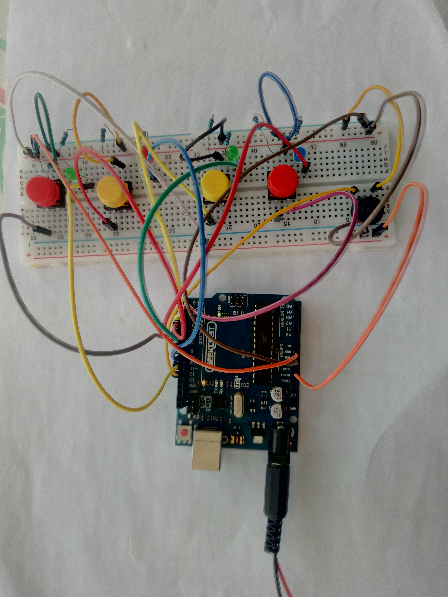
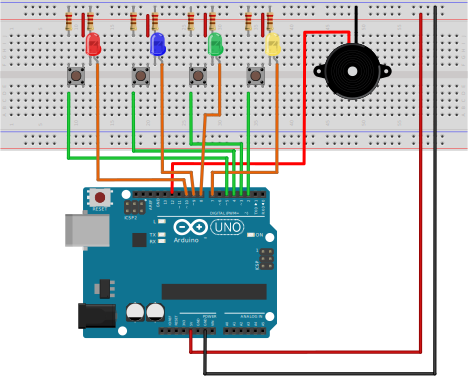

This project will consist of a game in which the microcontroller will generate a random sequence that we have to memorize and repeat.

> Ex: An LED lights up and we have to press the button associated with it. Then that same led and another will light up and we have to press the two buttons in the correct order. And so on.

In case of error, the horn will sound and all the LEDs will light up. If the game is won (10 levels) a song is played and a sequence of LEDs is displayed as a reward.

The difficulties of this work arise in the assemblying, which involves many connections that can become confusing. And also in the code, which is not particularly simple.

It is based on [Teensy/Arduino – Memory Game](https://randomnerdtutorials.com/teensy-arduino-memory-game/).

> Assembly

<div style = "display: flex; justify-content: center;">
  <div style = "width: 250px; 
  margin: 0 1rem;
    margin-bottom : 1.5rem;">
      
  </div>
  <div style = "width: 250px; 
  margin: 0 1rem;
    margin-bottom : 1.5rem;">
      
  </div>
</div>

Download the Fritzing assembly sketch: [💾](./download/memorygame_Sketch.fzz)

I must point out that the material must be tested in advance to make it easier to interpret errors that arise.

To test the material I used the code below, which initially lights up all the LEDs to verify that they all work correctly. Two seconds later, turns them off. Then you can test each of the buttons and check if the respective LED lights up. 

> Code

[💾 leds_buttons.ino](./download/leds_buttons.ino)
```arduino
/* LEDs and buttons test 
by josegneto.github.io */

const int button1 = 2; // 1st button
const int button2 = 3; // 2nd button
const int button3 = 4; // 3rd button
const int button4 = 5; // 4th button
const int led1 = 7;    // 1st button LED
const int led2 = 8;    // 2nd button LED
const int led3 = 9;    // 3rd button LED
const int led4 = 10;   // 4th button LED

int buttonState[4] = {0, 0, 0, 0};

void setup() {
  pinMode(button1, INPUT); 
  pinMode(button2, INPUT);
  pinMode(button3, INPUT);
  pinMode(button4, INPUT);
  
  pinMode(led1, OUTPUT);
  pinMode(led2, OUTPUT);
  pinMode(led3, OUTPUT);
  pinMode(led4, OUTPUT);

  // Turn every LED ON
  digitalWrite(led1, HIGH);
  digitalWrite(led2, HIGH);
  digitalWrite(led3, HIGH);
  digitalWrite(led4, HIGH);
  
  delay(2000);  

  // Turn every LED OFF
  digitalWrite(led1, LOW);
  digitalWrite(led2, LOW);
  digitalWrite(led3, LOW);
  digitalWrite(led4, LOW);
}

void loop(){

  // Store the button state into the array
  buttonState[0] = digitalRead(button1);
  buttonState[1] = digitalRead(button2);
  buttonState[2] = digitalRead(button3);
  buttonState[3] = digitalRead(button4);

  // Checkk if buttons were pressed
    
  if (buttonState[0] == HIGH) {
    // turn LED on:
    digitalWrite(led1, HIGH);
  }  
  if (buttonState[0] == LOW){
    // turn LED off:
    digitalWrite(led1, LOW);   
  }
    
  if (buttonState[1] == HIGH) {
    // turn LED on:
    digitalWrite(led2, HIGH);
  }  
  if (buttonState[1] == LOW){
    // turn LED off:
    digitalWrite(led2, LOW);   
  }

  if (buttonState[2] == HIGH) {
    // turn LED on:
    digitalWrite(led3, HIGH);
  }  
  if (buttonState[2] == LOW){
    // turn LED off:
    digitalWrite(led3, LOW);   
  }

  if (buttonState[3] == HIGH) {
    // turn LED on:
    digitalWrite(led4, HIGH);
  }  
  if (buttonState[3] == LOW){
    // turn LED off:
    digitalWrite(led4, LOW);   
  }
}
```

## Memory Game

> Code

Below is the code used in the servo controlling phase. Install the [IRLib2](https://github.com/cyborg5/IRLib2) library before compiling.

[💾 memorygame.ino](./download/memorygame.ino)
```arduino
/* Adapted from Random Nerd Tutorials
by josegneto.github.io */

// Constants
const int button1 = 2;          // 1st button controls Blue LED 
const int button2 = 3;          // 2nd button controls Yellow LED
const int button3 = 4;          // 3rd button controls Green LED
const int button4 = 5;          // 4th button controls Red LED
const int led1 = 7;             // Blue LED
const int led2 = 8;             // Yellow LED
const int led3 = 9;             // Green LED
const int led4 = 10;            // Red LED
const int buzzer = 12;          // Buzzer Output
const int tones[] = {1915, 1700, 1519, 1432, 2700};
// tones when you press the LED's - the last one is when you fail.

// Variables
int buttonState[] = {0,0,0,0};         // current state of the button
int lastButtonState[] = {0,0,0,0};     // previous state of the button
int buttonPushCounter[] = {0,0,0,0}; 


void playTone(int tone, int duration) {
  for (long i = 0; i < duration * 1000L; i += tone * 2) {
    digitalWrite(buzzer, HIGH);
    delayMicroseconds(tone);
    digitalWrite(buzzer, LOW);
    delayMicroseconds(tone);
  }
}

void setup() {
  // initialize inputs :
  randomSeed(analogRead(0));
  pinMode(button1, INPUT);
  pinMode(button2, INPUT);
  pinMode(button3, INPUT);
  pinMode(button4, INPUT);
  // initialize outputs:
  pinMode(led1, OUTPUT);
  pinMode(led2, OUTPUT);
  pinMode(led3, OUTPUT);
  pinMode(led4, OUTPUT);
  pinMode(buzzer, OUTPUT);
  // initialize serial communication for debugging:
  //Serial.begin(9600); 
}
int game_on = 0;
int wait = 0;
int currentlevel = 1; 
// This is the level (also the number of button presses to pass to next level)
long rand_num = 0; 
//initialize long variable for random number from 0-100.
int rando = 0; 
//initialize random integer for loopgame_on. Will be from 1-4 later.
int butwait = 500; 
//amount of time to wait for next button input (ghetto de-bounce)
int ledtime = 500; 
//amount of time each LED flashes for when button is pressed
int n_levels = 10; 
//number of levels until the game is won
int pinandtone = 0; 
//This integer is used when the sequence is displayed
int right = 0; 
//This variable must be 1 in order to go to the next level
int speedfactor = 5; 
//This is the final speed of the lights and sounds for the last level. This increases as more games are won
int leddelay = 200; 
//Initializing time for LED. This will decrease as the level increases

void loop() {
  
int n_array[n_levels];
int u_array[n_levels];

int i;
//clears arrays both "n_array" and "u_array" and starts a new game
if (game_on == 0){
for(i=0; i<n_levels; i=i+1){
        n_array[i]=0;
        u_array[i]=0;
        rand_num = random(1,200);
        if (rand_num <= 50)
          rando=0;
        else if (rand_num>50 && rand_num<=100)
          rando=1;
        else if (rand_num>100 && rand_num<=150)
          rando=2;
         else if (rand_num<=200)
          rando=3;
        //saves a random number in our n_array
         n_array[i]=rando;
      }
 game_on = 1; 

}


//shows the user the current sequence
if (wait == 0){
 delay (200);
i = 0;
for (i = 0; i < currentlevel; i= i + 1){
  leddelay = ledtime/(1+(speedfactor/n_levels)*(currentlevel - 1));
      pinandtone = n_array[i];
      digitalWrite(pinandtone+7, HIGH);
      playTone(tones[pinandtone], leddelay);
      digitalWrite(pinandtone+7, LOW);
      delay(100/speedfactor);
    }
    wait = 1;
}
i = 0;
int buttonchange = 0;    
int j = 0; // This is the current position in the sequence
while (j < currentlevel){    
    while (buttonchange == 0){
          for (i = 0; i < 4; i = i + 1){ 
          buttonState[i] = digitalRead(i+2);
          buttonchange = buttonchange + buttonState[i];
        }
    }
     for (i = 0; i < 4; i = i + 1){
        if (buttonState[i] == HIGH) {
            digitalWrite(i+7, HIGH);
            playTone(tones[i], ledtime);
            digitalWrite(i+7, LOW);
            wait = 0;
            u_array[j]=i; 
            buttonState[i] = LOW;
            buttonchange = 0;
         }
       } 
        if (u_array[j] == n_array[j]){
            j++;  
            right = 1;
            }
        else{
          
            right = 0;
            i = 4;
            j = currentlevel;
            wait = 0;
        }
}

if (right == 0){
  delay(300);
  i = 0;
  game_on = 0;
  currentlevel = 1;
  for (i = 0; i < 4; i = i + 1){
         digitalWrite(i+7, HIGH);
      }
          playTone(tones[4], ledtime);
   for (i = 0; i < 4; i = i + 1){
         digitalWrite(i+7, LOW);   
       }
       delay (200);
  for (i = 0; i < 4; i = i + 1){
         digitalWrite(i+7, HIGH);
      }
          playTone(tones[4], ledtime);
   for (i = 0; i < 4; i = i + 1){
         digitalWrite(i+7, LOW);   
       }
       
       delay(500);
       game_on = 0;
}


//if you insert the right sequence it levels up
if (right == 1){
    currentlevel++;
    wait = 0;
    }
//if you finish the game    
if (currentlevel == n_levels){
  delay(500);
  // The following is the victory sound:
  int notes[] = {2, 2, 2, 2, 0, 1, 2, 1, 2};
  int note = 0;
  int tempo[] = {200, 200, 200, 400, 400, 400, 200, 200, 600}; 
  int breaks[] = {100, 100, 100, 200, 200, 200, 300, 100, 200}; 
  for (i = 0; i < 9; i = i + 1){
  note = notes[i];
    digitalWrite(note+7, HIGH);
    playTone(tones[note], tempo[i]);
    digitalWrite(note+7, LOW);
    delay(breaks[i]);
  }
//sets game_on to 0, so it restarts a new game
game_on = 0;
currentlevel = 1;
n_levels = n_levels + 2;
speedfactor = speedfactor + 1;
    }
 
}
```
> Demo

In the demonstration below I reached the fourth level, pressed the wrong button and lost.

   <div style="text-align: center">
      <iframe width="480" height="360" src="https://www.youtube.com/embed/zRZKroVg4ZI"></iframe>
   </div>