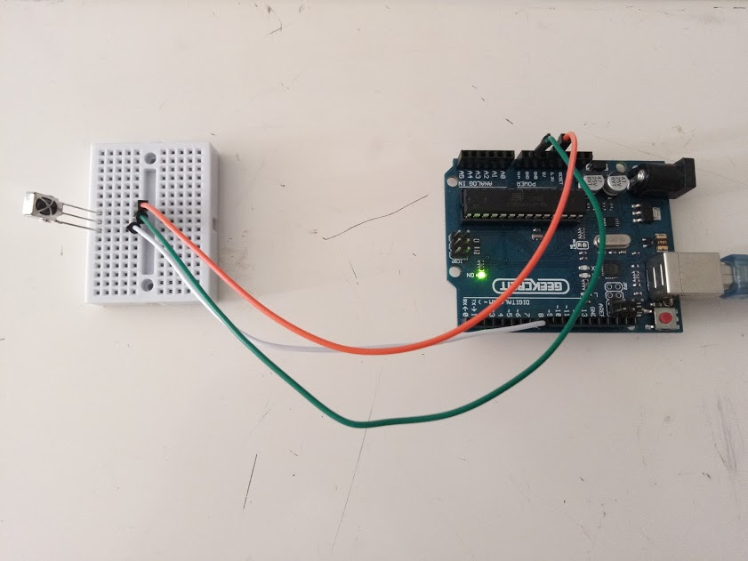
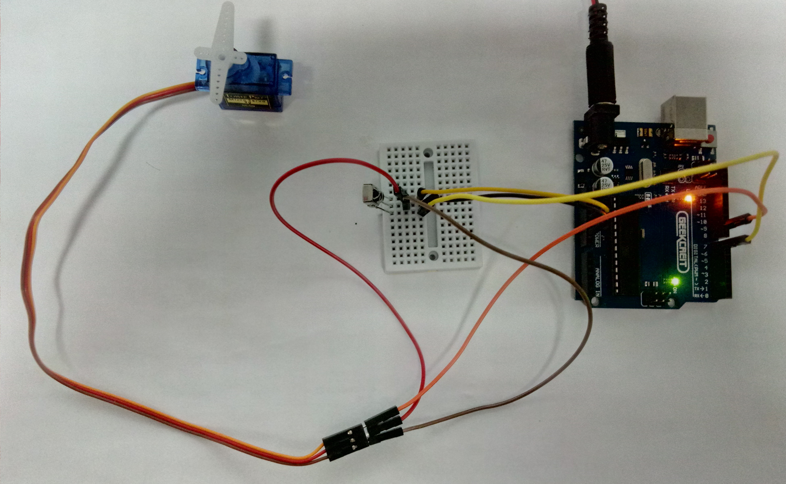

This project was developed during university summer break, after my first course using microcontrollers. 

It is based on [Controlling a Servo with IR](https://learn.adafruit.com/using-an-infrared-library/controlling-a-servo-with-ir-1) and [How to Set Up an IR Remote and Receiver on an Arduino](http://www.circuitbasics.com/arduino-ir-remote-receiver-tutorial/).

The objective is to control a Servo motor using an infrared controller.

---
## Phases
    
1. **Decode the controller**: obtain the code corresponding to each of the buttons so that the microcontroller knows which one is being pressed.

2. **Send instructions to the servo**, depending on which button is pressed:
    - Adjust the speed at which the motor will move.
    - Make the motor rotate to positions previously defined.

The work presented will not bring any major difficulties, as both the assembly and the code are easy to follow. Perhaps the decoding part is the most laborious, as we have to register about 28 codes (depending on the controller), which can become repetitive. 

## Material

* Servo motor
* Remote controller
* IR receiver
* Microcontroller (used: Arduino Uno)
* Breadboard (mini is enough)
* Jumper Wires

## Remote Decoding

Start by decoding the remote controller buttons. Each remote has a different set of codes.
I used the remote below.


> Assembly

<div style = "display: flex; justify-content: center;">
  <div style = "width: 250px; 
  margin: 0 1rem;
    margin-bottom : 1.5rem;">
      
  </div>
  <div style = "width: 250px; 
  margin: 0 1rem;
    margin-bottom : 1.5rem;">
      
  </div>
</div>

Download the Fritzing assembly sketch (Fritzing): [💾](./download/IR_decoder_Sketch.fzz)

Be careful about the receiver pin, they change depending on its model: 


> Code

Below is the code used in the decoding phase. Install the [IRremote](https://github.com/Arduino-IRremote/Arduino-IRremote) library before compiling.

[💾 IR_decoder.ino](./download/IR_decoder.ino)
```arduino
/* Adapted from Examples -> IRremote -> IRrecvDemo
by josegneto.github.io */

#include <IRremote.h>

const int RECV_PIN = 7; // Receiver Pin
IRrecv irrecv(RECV_PIN);
decode_results results;

void setup()
{
  Serial.begin(9600);
  irrecv.enableIRIn();
  irrecv.blink13(true);
}

void loop()
{
  if (irrecv.decode(&results))
  {
    Serial.println(results.value, HEX); 
    // Prints the HEX code in the Serial Monitor
    irrecv.resume();
  }
}
```
> Interpretation of the results

When a button is pressed, the correspoding HEX code is printed in the IDE's Serial Monitor. In the example below, buttons 1-4 were pressed.


The following table shows the codes for each of the buttons:

<table class ="teste" align="center" style="border: 0.75pt solid #FFF; border-collapse: collapse;" cellspacing="0"
            cellpadding="0">
            <tbody>
               <tr style="height: 27.25pt;">
                  <td
                     style="width: 65.75pt; border-right-style: solid; border-right-width: 0.75pt; border-bottom-style: solid; border-bottom-width: 0.75pt; padding-right: 5.03pt; padding-left: 5.03pt; vertical-align: top;">                     
                     <p class = "table_row"><strong><span
                              style="font-family: Calibri; color: #4472c4;">Bot&atilde;o</span></strong></p>                     
                  </td>
                  <td
                     class = "table_td">                     
                     <p class = "table_row"><strong><span
                              style="font-family: Calibri; color: #4472c4;">C&oacute;digo</span></strong></p>
                  </td>
                  <td
                     class = "table_td">                    
                     <p class = "table_row"><strong><span
                              style="font-family: Calibri; color: #4472c4;">Bot&atilde;o</span></strong></p>
                  </td>
                  <td
                     class = "table_td">
                     <p class = "table_row"><strong><span
                              style="font-family: Calibri; color: #4472c4;">C&oacute;digo</span></strong></p>
                  </td>
                  <td
                     class = "table_td">                     
                     <p class = "table_row"><strong><span
                              style="font-family: Calibri; color: #4472c4;">Bot&atilde;o</span></strong></p>
                  </td>
                  <td
                     style="width: 65.75pt; border-left-style: solid; border-left-width: 0.75pt; border-bottom-style: solid; border-bottom-width: 0.75pt; padding-right: 5.03pt; padding-left: 5.03pt; vertical-align: top;">                     
                     <p class = "table_row"><strong><span
                              style="font-family: Calibri; color: #4472c4;">C&oacute;digo</span></strong></p>
                  </td>
               </tr>
               <tr style="height: 17pt;">
                  <td
                     style="width: 65.75pt; border-top-style: solid; border-top-width: 0.75pt; border-right-style: solid; border-right-width: 0.75pt; border-bottom-style: solid; border-bottom-width: 0.75pt; padding-right: 5.03pt; padding-left: 5.03pt; vertical-align: top;">
                     <p class = "table_row"><strong><span
                              style="font-family: Calibri;">CH-</span></strong></p>
                  </td>
                  <td
                     style="width: 65.75pt; border-style: solid; border-width: 0.75pt; padding-right: 5.03pt; padding-left: 5.03pt; vertical-align: top;">
                     <p class = "table_row"><span
                           style="font-family: Calibri;">0x1FE48B7</span></p>
                  </td>
                  <td
                     style="width: 65.75pt; border-style: solid; border-width: 0.75pt; padding-right: 5.03pt; padding-left: 5.03pt; vertical-align: top;">
                     <p class = "table_row"><strong><span
                              style="font-family: Calibri;">CH</span></strong></p>
                  </td>
                  <td
                     style="width: 65.75pt; border-style: solid; border-width: 0.75pt; padding-right: 5.03pt; padding-left: 5.03pt; vertical-align: top;">
                     <p class = "table_row"><span
                           style="font-family: Calibri;">0x1FE58A7</span></p>
                  </td>
                  <td
                     style="width: 65.75pt; border-style: solid; border-width: 0.75pt; padding-right: 5.03pt; padding-left: 5.03pt; vertical-align: top;">
                     <p class = "table_row"><strong><span
                              style="font-family: Calibri;">CH+</span></strong></p>
                  </td>
                  <td
                     style="width: 65.75pt; border-top-style: solid; border-top-width: 0.75pt; border-left-style: solid; border-left-width: 0.75pt; border-bottom-style: solid; border-bottom-width: 0.75pt; padding-right: 5.03pt; padding-left: 5.03pt; vertical-align: top;">
                     <p class = "table_row"><span
                           style="font-family: Calibri;">0x1FE7887</span></p>
                  </td>
               </tr>
               <tr style="height: 17pt;">
                  <td
                     style="width: 65.75pt; border-top-style: solid; border-top-width: 0.75pt; border-right-style: solid; border-right-width: 0.75pt; border-bottom-style: solid; border-bottom-width: 0.75pt; padding-right: 5.03pt; padding-left: 5.03pt; vertical-align: top;">
                     <p class = "table_row">⏪</p>
                  </td>
                  <td
                     style="width: 65.75pt; border-style: solid; border-width: 0.75pt; padding-right: 5.03pt; padding-left: 5.03pt; vertical-align: top;">
                     <p class = "table_row"><span
                           style="font-family: Calibri;">0x1FE807F</span></p>
                  </td>
                  <td
                     style="width: 65.75pt; border-style: solid; border-width: 0.75pt; padding-right: 5.03pt; padding-left: 5.03pt; vertical-align: top;">
                     <p class = "table_row">⏩</p>
                  </td>
                  <td
                     style="width: 65.75pt; border-style: solid; border-width: 0.75pt; padding-right: 5.03pt; padding-left: 5.03pt; vertical-align: top;">
                     <p class = "table_row"><span
                           style="font-family: Calibri;">0x1FE40BF</span></p>
                  </td>
                  <td
                     style="width: 65.75pt; border-style: solid; border-width: 0.75pt; padding-right: 5.03pt; padding-left: 5.03pt; vertical-align: top;">
                     <p class = "table_row">⏯️</p>
                  </td>
                  <td
                     style="width: 65.75pt; border-top-style: solid; border-top-width: 0.75pt; border-left-style: solid; border-left-width: 0.75pt; border-bottom-style: solid; border-bottom-width: 0.75pt; padding-right: 5.03pt; padding-left: 5.03pt; vertical-align: top;">
                     <p class = "table_row"><span
                           style="font-family: Calibri;">0x1FEC03F</span></p>
                  </td>
               </tr>
               <tr style="height: 17pt;">
                  <td
                     style="width: 65.75pt; border-top-style: solid; border-top-width: 0.75pt; border-right-style: solid; border-right-width: 0.75pt; border-bottom-style: solid; border-bottom-width: 0.75pt; padding-right: 5.03pt; padding-left: 5.03pt; vertical-align: top;">
                     <p class = "table_row"><strong><span
                              style="font-family: Calibri;">Vol -</span></strong></p>
                  </td>
                  <td
                     style="width: 65.75pt; border-style: solid; border-width: 0.75pt; padding-right: 5.03pt; padding-left: 5.03pt; vertical-align: top;">
                     <p class = "table_row"><span
                           style="font-family: Calibri;">0x1FE20DF</span></p>
                  </td>
                  <td
                     style="width: 65.75pt; border-style: solid; border-width: 0.75pt; padding-right: 5.03pt; padding-left: 5.03pt; vertical-align: top;">
                     <p class = "table_row"><strong><span
                              style="font-family: Calibri;">Vol +</span></strong></p>
                  </td>
                  <td
                     style="width: 65.75pt; border-style: solid; border-width: 0.75pt; padding-right: 5.03pt; padding-left: 5.03pt; vertical-align: top;">
                     <p class = "table_row"><span
                           style="font-family: Calibri;">0x1FEA05F</span></p>
                  </td>
                  <td
                     style="width: 65.75pt; border-style: solid; border-width: 0.75pt; padding-right: 5.03pt; padding-left: 5.03pt; vertical-align: top;">
                     <p class = "table_row"><strong><span
                              style="font-family: Calibri;">EQ</span></strong></p>
                  </td>
                  <td
                     style="width: 65.75pt; border-top-style: solid; border-top-width: 0.75pt; border-left-style: solid; border-left-width: 0.75pt; border-bottom-style: solid; border-bottom-width: 0.75pt; padding-right: 5.03pt; padding-left: 5.03pt; vertical-align: top;">
                     <p class = "table_row"><span
                           style="font-family: Calibri;">0x1FE609F</span></p>
                  </td>
               </tr>
               <tr style="height: 17pt;">
                  <td
                     style="width: 65.75pt; border-top-style: solid; border-top-width: 0.75pt; border-right-style: solid; border-right-width: 0.75pt; border-bottom-style: solid; border-bottom-width: 0.75pt; padding-right: 5.03pt; padding-left: 5.03pt; vertical-align: top;">
                     <p class = "table_row"><strong><span
                              style="font-family: Calibri;">0</span></strong></p>
                  </td>
                  <td
                     style="width: 65.75pt; border-style: solid; border-width: 0.75pt; padding-right: 5.03pt; padding-left: 5.03pt; vertical-align: top;">
                     <p class = "table_row"><span
                           style="font-family: Calibri;">0x1FEE01F</span></p>
                  </td>
                  <td
                     style="width: 65.75pt; border-style: solid; border-width: 0.75pt; padding-right: 5.03pt; padding-left: 5.03pt; vertical-align: top;">
                     <p class = "table_row"><strong><span
                              style="font-family: Calibri;">100+</span></strong></p>
                  </td>
                  <td
                     style="width: 65.75pt; border-style: solid; border-width: 0.75pt; padding-right: 5.03pt; padding-left: 5.03pt; vertical-align: top;">
                     <p class = "table_row"><span
                           style="font-family: Calibri;">0x1FE10EF</span></p>
                  </td>
                  <td
                     style="width: 65.75pt; border-style: solid; border-width: 0.75pt; padding-right: 5.03pt; padding-left: 5.03pt; vertical-align: top;">
                     <p class = "table_row"><strong><span
                              style="font-family: Calibri;">200+</span></strong></p>
                  </td>
                  <td
                     style="width: 65.75pt; border-top-style: solid; border-top-width: 0.75pt; border-left-style: solid; border-left-width: 0.75pt; border-bottom-style: solid; border-bottom-width: 0.75pt; padding-right: 5.03pt; padding-left: 5.03pt; vertical-align: top;">
                     <p class = "table_row"><span
                           style="font-family: Calibri;">0x1FE906F</span></p>
                  </td>
               </tr>
               <tr style="height: 17pt;">
                  <td
                     style="width: 65.75pt; border-top-style: solid; border-top-width: 0.75pt; border-right-style: solid; border-right-width: 0.75pt; border-bottom-style: solid; border-bottom-width: 0.75pt; padding-right: 5.03pt; padding-left: 5.03pt; vertical-align: top;">
                     <p class = "table_row"><strong><span
                              style="font-family: Calibri;">1</span></strong></p>
                  </td>
                  <td
                     style="width: 65.75pt; border-style: solid; border-width: 0.75pt; padding-right: 5.03pt; padding-left: 5.03pt; vertical-align: top;">
                     <p class = "table_row"><span
                           style="font-family: Calibri;">0x1FE50AF</span></p>
                  </td>
                  <td
                     style="width: 65.75pt; border-style: solid; border-width: 0.75pt; padding-right: 5.03pt; padding-left: 5.03pt; vertical-align: top;">
                     <p class = "table_row"><strong><span
                              style="font-family: Calibri;">2</span></strong></p>
                  </td>
                  <td
                     style="width: 65.75pt; border-style: solid; border-width: 0.75pt; padding-right: 5.03pt; padding-left: 5.03pt; vertical-align: top;">
                     <p class = "table_row"><span
                           style="font-family: Calibri;">0x1FED827</span></p>
                  </td>
                  <td
                     style="width: 65.75pt; border-style: solid; border-width: 0.75pt; padding-right: 5.03pt; padding-left: 5.03pt; vertical-align: top;">
                     <p class = "table_row"><strong><span
                              style="font-family: Calibri;">3</span></strong></p>
                  </td>
                  <td
                     style="width: 65.75pt; border-top-style: solid; border-top-width: 0.75pt; border-left-style: solid; border-left-width: 0.75pt; border-bottom-style: solid; border-bottom-width: 0.75pt; padding-right: 5.03pt; padding-left: 5.03pt; vertical-align: top;">
                     <p class = "table_row"><span
                           style="font-family: Calibri;">0x1FEF807</span></p>
                  </td>
               </tr>
               <tr style="height: 17pt;">
                  <td
                     style="width: 65.75pt; border-top-style: solid; border-top-width: 0.75pt; border-right-style: solid; border-right-width: 0.75pt; border-bottom-style: solid; border-bottom-width: 0.75pt; padding-right: 5.03pt; padding-left: 5.03pt; vertical-align: top;">
                     <p class = "table_row"><strong><span
                              style="font-family: Calibri;">4</span></strong></p>
                  </td>
                  <td
                     style="width: 65.75pt; border-style: solid; border-width: 0.75pt; padding-right: 5.03pt; padding-left: 5.03pt; vertical-align: top;">
                     <p class = "table_row"><span
                           style="font-family: Calibri;">0x1FE30CF</span></p>
                  </td>
                  <td
                     style="width: 65.75pt; border-style: solid; border-width: 0.75pt; padding-right: 5.03pt; padding-left: 5.03pt; vertical-align: top;">
                     <p class = "table_row"><strong><span
                              style="font-family: Calibri;">5</span></strong></p>
                  </td>
                  <td
                     style="width: 65.75pt; border-style: solid; border-width: 0.75pt; padding-right: 5.03pt; padding-left: 5.03pt; vertical-align: top;">
                     <p class = "table_row"><span
                           style="font-family: Calibri;">0x1FEB04F</span></p>
                  </td>
                  <td
                     style="width: 65.75pt; border-style: solid; border-width: 0.75pt; padding-right: 5.03pt; padding-left: 5.03pt; vertical-align: top;">
                     <p class = "table_row"><strong><span
                              style="font-family: Calibri;">6</span></strong></p>
                  </td>
                  <td
                     style="width: 65.75pt; border-top-style: solid; border-top-width: 0.75pt; border-left-style: solid; border-left-width: 0.75pt; border-bottom-style: solid; border-bottom-width: 0.75pt; padding-right: 5.03pt; padding-left: 5.03pt; vertical-align: top;">
                     <p class = "table_row"><span
                           style="font-family: Calibri;">0x1FE708F</span></p>
                  </td>
               </tr>
               <tr style="height: 17pt;">
                  <td
                     style="width: 65.75pt; border-top-style: solid; border-top-width: 0.75pt; border-right-style: solid; border-right-width: 0.75pt; padding-right: 5.03pt; padding-left: 5.03pt; vertical-align: top;">
                     <p class = "table_row"><strong><span
                              style="font-family: Calibri;">7</span></strong></p>
                  </td>
                  <td
                     style="width: 65.75pt; border-top-style: solid; border-top-width: 0.75pt; border-right-style: solid; border-right-width: 0.75pt; border-left-style: solid; border-left-width: 0.75pt; padding-right: 5.03pt; padding-left: 5.03pt; vertical-align: top;">
                     <p class = "table_row"><span
                           style="font-family: Calibri;">0x1FE00FF</span></p>
                  </td>
                  <td
                     style="width: 65.75pt; border-top-style: solid; border-top-width: 0.75pt; border-right-style: solid; border-right-width: 0.75pt; border-left-style: solid; border-left-width: 0.75pt; padding-right: 5.03pt; padding-left: 5.03pt; vertical-align: top;">
                     <p class = "table_row"><strong><span
                              style="font-family: Calibri;">8</span></strong></p>
                  </td>
                  <td
                     style="width: 65.75pt; border-top-style: solid; border-top-width: 0.75pt; border-right-style: solid; border-right-width: 0.75pt; border-left-style: solid; border-left-width: 0.75pt; padding-right: 5.03pt; padding-left: 5.03pt; vertical-align: top;">
                     <p class = "table_row"><span
                           style="font-family: Calibri;">0x1FEF00F</span></p>
                  </td>
                  <td
                     style="width: 65.75pt; border-top-style: solid; border-top-width: 0.75pt; border-right-style: solid; border-right-width: 0.75pt; border-left-style: solid; border-left-width: 0.75pt; padding-right: 5.03pt; padding-left: 5.03pt; vertical-align: top;">
                     <p class = "table_row"><strong><span
                              style="font-family: Calibri;">9</span></strong></p>
                  </td>
                  <td
                     style="width: 65.75pt; border-top-style: solid; border-top-width: 0.75pt; border-left-style: solid; border-left-width: 0.75pt; padding-right: 5.03pt; padding-left: 5.03pt; vertical-align: top;">
                     <p class = "table_row"><span
                           style="font-family: Calibri;">0x1FE9867</span></p>
                  </td>
               </tr>
            </tbody>
         </table>

The process is similar with any other controller. I tried it with the TV controller and the result was similar, only the button codes are different (as expected). 

The difference between controllers appears in the next step, as there are different protocols depending on their manufacturer. The most common protocol in remotes that come with Arduino beginner kits is NEC, while the TV remote I tried uses SAMSUNG. 

## Controlling the servo

The next step is to give commands to the servo: rotate certain degrees, defined by the user, or permanently rotate at a speed (number of degrees) indicated by us.

For this, we have to adapt the previous assembly to accommodate the servo and give it instructions. 

> Assembly

<div style = "display: flex; justify-content: center;">
  <div style = "width: 250px; 
  margin: 0 1rem;
    margin-bottom : 1.5rem;">
      
  </div>
  <div style = "width: 250px; 
  margin: 0 1rem;
    margin-bottom : 1.5rem;">
      
  </div>
</div>

Download the Fritzing assembly sketch (Fritzing): [💾](./download/servo_IR_Sketch.fzz)

If the image is not clear, the assembling is identical to the previous one.

We just need to connect the servo. Mine has three cables: brown, red and orange. Brown must be connected to GND (Ground), red to VCC (+5V) and orange to pin (9) defined further down in the code. 

> Code

Below is the code used in the servo controlling phase. Install the [IRLib2](https://github.com/cyborg5/IRLib2) library before compiling.

[💾 IR_servo.ino](./download/IR_servo.ino)
```arduino
/*  Adapted from Examples -> IRLib2 -> servo 
by josegneto.github.io */

#include <IRLibAll.h>
#include <Servo.h>

// You will have to set these values depending on the protocol
// and remote codes that you are using

#define MY_PROTOCOL NEC
#define CH-           0x1FE48B7
#define CH            0x1FE58A7
#define CH+           0x1FE7887
#define FAST_BACKWARD 0x1FE807F     // Move the servo counterclockwise
#define FAST_FORWARD  0x1FE40BF     // Move the servo clockwise
#define PLAY_PAUSE    0x1FEC03F     // Center the servo
#define VOLDEC        0x1FE20DF     // Decrease the speed
#define VOLINC        0x1FEA05F     // Increase the speed
#define EQ            0x1FE609F
#define BUTTON_0      0x1FEE01F     // Rotates key * 20 degrees at a time
#define BUTTON_1      0x1FE50AF     // User defined position
#define BUTTON_2      0x1FED827
#define BUTTON_3      0x1FEF807
#define BUTTON_4      0x1FE30CF
#define BUTTON_5      0x1FEB04F
#define BUTTON_6      0x1FE708F
#define BUTTON_7      0x1FE00FF
#define BUTTON_8      0x1FEF00F
#define BUTTON_9      0x1FE9867

IRrecv myReceiver(11); // Receiver pin
IRdecode myDecoder;

Servo myServo;     // Create servo object to control a servo
int16_t pos;       // Variable to store the servo position
int16_t Speed;     // Degrees to move when a left/right button is pressed
uint32_t Previous; // Handles NEC repeat codes

void setup()
{
  myServo.attach(9);       // Attaches the servo on pin 9 to its object
  pos = 90;                // Start at midpoint 90 degrees
  Speed = 3;               // Moves 3 degrees when left/right is pushed
  myServo.write(pos);      // Set initial position
  myReceiver.enableIRIn(); // Start the receiver
}

void loop() 
{ 
    if (myReceiver.getResults()) {
       myDecoder.decode();
       if(myDecoder.protocolNum==MY_PROTOCOL) {
         if(myDecoder.value==0xFFFFFFFF)
           myDecoder.value=Previous;
         switch(myDecoder.value) {
            case FAST_BACKWARD: pos=min(180,pos+Speed); break;
            case FAST_FORWARD:  pos=max(0,pos-Speed); break;
            case PLAY_PAUSE:    pos=90; break;
            case VOLDEC:        Speed=min(10, Speed+1); break;
            case VOLINC:        Speed=max(1, Speed-1); break;
            case BUTTON_0:      pos=0*20; break;
            case BUTTON_1:      pos=1*20; break;
            case BUTTON_2:      pos=2*20; break;
            case BUTTON_3:      pos=3*20; break;
            case BUTTON_4:      pos=4*20; break;
            case BUTTON_5:      pos=5*20; break;
            case BUTTON_6:      pos=6*20; break;
            case BUTTON_7:      pos=7*20; break;
            case BUTTON_8:      pos=8*20; break;
            case BUTTON_9:      pos=9*20; break;
         }
         myServo.write(pos); // Servo goes to position in variable 'pos' 
         Previous=myDecoder.value;
       }
       myReceiver.enableIRIn();
    }
}
```
> Demo

In the demonstration below the servo is moving when the buttons ⏪ and ⏩ are pressed. 

   <div style="text-align: center">
      
   </div>